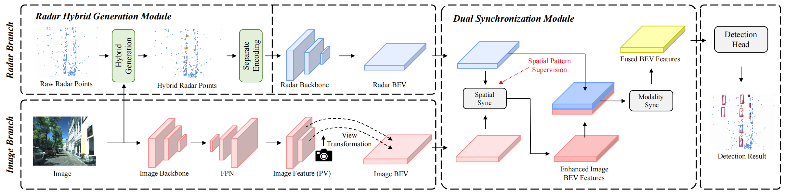

<div align="center">   

# HGSFusion: Radar-Camera Fusion with Hybrid Generation and Synchronization for 3D Object Detection

</div>
<div align="center">   
[](https://arxiv.org/abs/2412.11489) 
[](LICENSE)
</div>

## Abstract
Millimeter-wave radar plays a vital role in 3D object detection for autonomous driving due to its all-weather and all-lighting-condition capabilities for perception. However, radar point clouds suffer from pronounced sparsity and unavoidable angle estimation errors. To address these limitations, incorporating a camera may partially help mitigate the shortcomings. Nevertheless, the direct fusion of radar and camera data can lead to negative or even opposite effects due to the lack of depth information in images and low-quality image features under adverse lighting conditions. Hence, in this paper, we present the radar-camera fusion network with Hybrid Generation and Synchronization (HGSFusion), designed to better fuse radar potentials and image features for 3D object detection. Specifically, we propose the Radar Hybrid Generation Module (RHGM), which fully considers the Direction-Of-Arrival (DOA) estimation errors in radar signal processing. This module generates denser radar points through different Probability Density Functions (PDFs) with the assistance of semantic information. Meanwhile, we introduce the Dual Sync Module (DSM), comprising spatial sync and modality sync, to enhance image features with radar positional information and facilitate the fusion of distinct characteristics in different modalities. Extensive experiments demonstrate the effectiveness of our approach, outperforming the state-of-the-art methods in the VoD and TJ4DRadSet datasets by $6.53\%$ and $2.03\%$ in RoI AP and BEV AP, respectively.

## Method


# Citation
If you find our work helpful to your research, please consider citing:


```shell
@article{Gu_2025_AAAI,
  title={HGSFusion: Radar-Camera Fusion with Hybrid Generation and Synchronization for 3D Object Detection},
  author={Zijian Gu, Jianwei Ma, Yan Huang, Honghao Wei, Zhanye Chen, Hui Zhang, Wei Hong},
  journal={Proceedings of the AAAI Conference on Artificial Intelligence},
  year={2025}
}
```

## Model Zoo
We offer the model on VoD and TJ4DRadset.

| Datset | Config | Weight | 
| -- | -- | -- |
| VoD | [hgsfusion_vod.yaml](tools/cfgs/hgsfusion/hgsfusion_vod.yaml) | [Google](https://drive.google.com/drive/folders/1zSbldzARH41y5O5aBYeg7BOc_uiAHXhD?usp=sharing) [Baidu](https://pan.baidu.com/s/1BY6GWWFu9dak5AMzthfA3g?pwd=hti9) |
| TJ4D | [hgsfusion_tj4d.yaml](tools/cfgs/hgsfusion/hgsfusion_tj4d.yaml) | [Google](https://drive.google.com/drive/folders/1zSbldzARH41y5O5aBYeg7BOc_uiAHXhD?usp=sharing) [Baidu](https://pan.baidu.com/s/1BY6GWWFu9dak5AMzthfA3g?pwd=hti9) |

- The image backbone is pretrained on the COCO dataset, you can download from [here](https://download.pytorch.org/models/deeplabv3_resnet101_coco-586e9e4e.pth) and place the weight to `checkpoints/deeplabv3_resnet101_coco-586e9e4e.pt`

## Environment
> The requirements are the same as those of [OpenPCDet](https://github.com/open-mmlab/OpenPCDet)

Install PyTorch 1.13 + CUDA 11.6:
```
conda create -n hgsfusion python=3.9.18
conda activate hgsfusion
pip install torch==1.13.0+cu116 -f https://download.pytorch.org/whl/torch_stable.html
pip install torchvision==0.14.0+cu116 -f https://download.pytorch.org/whl/torch_stable.html
```

Install other dependices:
```
pip install openmim
pip install mmcv==2.1.0
pip install mmdet==3.3.0
```

Compile CUDA extensions:
```
git clone https://github.com/garfield-cpp/HGSFusion.git
python setup.py develop
cd pcdet\ops\pillar_ops
python setup.py develop
```

## Prepare Datset

1. Download VoD and TJ4DRadset. Link the dataset to the folder under `data/`
```
mkdir data
ln -s /path/to/vod/dataset/ ./data/vod_radar_5frames
ln -s /path/to/tj4d/dataset/ ./data/tj4d
```
2. You can download the hybrid radar points from [Google](https://drive.google.com/drive/folders/1zSbldzARH41y5O5aBYeg7BOc_uiAHXhD?usp=sharing) or [Baidu](https://pan.baidu.com/s/1BY6GWWFu9dak5AMzthfA3g?pwd=hti9) and unzip them to the dataset folder.

3. (Optional) Or you can choose to generate hybrid radar points by yourself following [here](hybrid_pts/README.md).
4. Generate the pkl files of VoD and TJ4DRadset by replacing `dataset_name` to `vod_dataset` and `tj4d_dataset` respectively.
```
python pcdet.datasets.kitti.dataset_name
```
5. Folder structure:
```
data
├── dataset_name
│   ├── ImageSets
│   ├── kitti_infos_test.pkl
│   ├── kitti_infos_train.pkl
│   ├── kitti_infos_trainval.pkl
│   ├── kitti_infos_val.pkl
│   ├── testing
│   └── training
|   |   ├── calib                               
|   |   ├── pose
|   |   ├── velodyne
|   |   ├── image_2
|   |   ├── mask_maskformer_with_label_k_1_gauss_k_4_uniform      
|   |   └── label_2                                        
```

## Training and Evaluating
Train HGSFusion with 4 GPUs:
```
export CUDA_VISIBLE_DEVICES=0,1,2,3 bash ./tools/scripts/dist_train.sh 4
```
Single-GPU Evaluation:
```
python ./tools/test.py --cfg_file ./tools/cfgs/hgsfusion/hgsfusion_vod.yaml --ckpy ./path/to/your/ckpt
```

## Acknowledgements

Many thanks to the open-source repositories:

- [OpenPCDet](https://github.com/open-mmlab/OpenPCDet)

- [Mask2Former](https://github.com/facebookresearch/Mask2Former)
